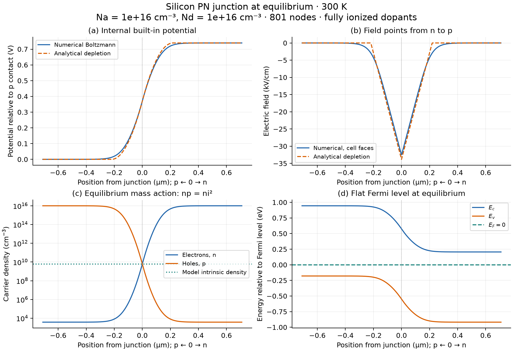
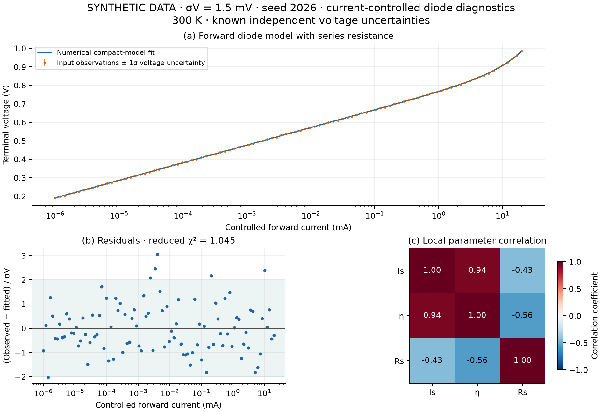

# PN-Junction Electrostatics and Diode Diagnostics

Solve equilibrium silicon junctions and extract compact diode parameters with independent numerical checks, uncertainty estimates and explicit model limits.

[](https://github.com/Atabrahim/pn-junction-diagnostics/actions/workflows/ci.yml)
[](LICENSE)



*Numerical Poisson–Boltzmann solution versus the analytical depletion approximation, at 300 K with Na = Nd = 10¹⁶ cm⁻³. Field points from n to p; the equilibrium Fermi level is flat. These are model results, not measured profiles.*

## What this solves

A junction calculation should explain how charge creates potential and field—and demonstrate that its numerical answer is converged. An I–V fit should show whether the data constrain its parameters, not merely draw a smooth curve.

This package provides two deliberately separate workflows:

- **Equilibrium electrostatics:** an abrupt silicon homojunction, with potential, electric field, electron/hole density, space charge and band energies. Conservative finite volumes, an analytic tridiagonal Jacobian and damped Newton iteration solve the nonlinear problem.
- **Diode diagnostics:** forward I–V evaluation and extraction of saturation current, ideality factor and series resistance, with residuals, local covariance, correlations and identifiability warnings.

The equilibrium solver **does not predict biased diode current**. The compact diode model is fitted separately. No experimental validation or industrial TCAD capability is claimed.

## Install

Python 3.11–3.13 is tested. NumPy and SciPy are core dependencies; Matplotlib is optional for figures. Install from this repository; the project is not published on PyPI.

```bash
git clone https://github.com/Atabrahim/pn-junction-diagnostics.git
cd pn-junction-diagnostics
python -m venv .venv
source .venv/bin/activate
python -m pip install ".[plots]"
```

On Windows PowerShell, activate with `.venv\Scripts\Activate.ps1` instead of the `source` command.

## Use the CLI

```bash
pn-junction --help
pn-junction simulate --acceptor-cm3 1e16 --donor-cm3 1e16 --temperature-k 300 --cells 400 --output outputs/junction.csv
pn-junction fit data/synthetic_diode.csv --temperature-k 300 --output outputs/diode_fit.json
```

`simulate` writes unit-labeled CSV profiles and prints a JSON summary. `fit` accepts columns `current_A`, `voltage_V`, `sigma_voltage_V` and writes a JSON fit report. The fitting convention is **controlled current with negligible current error and independent voltage uncertainty of known standard deviation**. Do not apply that likelihood unchanged to noisy-current measurements. `python -m pn_junction` provides the same commands.

## Use the Python API

```python
import numpy as np
from pn_junction import (
    Junction,
    solve_equilibrium,
    DiodeParameters,
    voltage_at_current,
    fit_diode,
)

junction = Junction(acceptor_cm3=1e16, donor_cm3=1e16, temperature_K=300)
profile = solve_equilibrium(junction, cells_per_side=400)
print(junction.built_in_voltage_V)  # about 0.7394 V
print(profile.gauss_error_C_m2)  # discrete integrated charge-flux mismatch

current_A = np.geomspace(1e-9, 0.02, 100)
truth = DiodeParameters(
    saturation_current_A=1e-11, ideality_factor=1.6, series_resistance_ohm=5
)
voltage_V = voltage_at_current(current_A, truth)
fit = fit_diode(current_A, voltage_V, sigma_voltage_V=0.0015)
print(fit.parameters)  # noiseless synthetic recovery, not experimental data
print(fit.standard_errors)  # local errors conditional on supplied voltage uncertainty
```

The package also exports `current_at_voltage`, `depletion_approximation`, `depletion_profile`, `silicon` and result dataclasses. Optional plots are in `pn_junction.plotting`; independent checks are in `pn_junction.validation`.

## Scientific model

For reduced potential $u=(E_F-E_i)/(k_BT)$, the equilibrium model is

$$n=n_i e^u,\qquad p=n_i e^{-u},\qquad
\frac{d^2u}{dx^2}=-\frac{q10^6}{\varepsilon V_T}(p-n+N_D-N_A).$$

Densities are in cm⁻³; position is in m; $V_T=k_BT/q$ is in V. Neutral bulk contacts supply Dirichlet values. The factor 10⁶ converts density to m⁻³. The model uses temperature-dependent bandgap, fixed effective masses, Boltzmann statistics and fully ionized dopants.

The separate compact model is

$$V(I)=\eta V_T\ln(1+I/I_s)+IR_s.$$

Here $I,I_s$ are in A, $V$ in V, $R_s$ in Ω and ideality factor $\eta$ is dimensionless. Bounded weighted least squares fits $(\ln I_s,\eta,R_s)$ using an analytic Jacobian. SVD provides local covariance and rank diagnostics. See [the model derivation](docs/MODEL.md) for parameters, units, boundary conditions and sources.

## Results and validation

For the default junction, the internal built-in potential is **0.7394 V**, the analytical depletion width is **0.4373 µm**, and the numerical peak field is about **32.48 kV/cm** (the depletion approximation gives 33.82 kV/cm).

- **61 automated tests** cover physics invariants, limiting cases, convergence, parameter recovery, uncertainty, invalid inputs and CLI behavior.
- **Nine independent electrostatics comparisons** at 250–400 K and doping ratios up to 1,000 pass the release gates: worst potential difference **0.112 mV**, worst interface-field difference **0.155%**.
- Doubling the mesh reduces potential error by approximately **fourfold** in the demonstrated studies.
- Collocation and an analytical first integral retain mobile charge. Their agreement checks the implementation even when the depletion approximation differs.



*Synthetic current-controlled observations with independent 1.5 mV voltage noise. The fit recovers Is = 9.9474 × 10⁻¹² A, η = 1.599789 and Rs = 4.9382 Ω; truth is 10⁻¹¹ A, 1.6 and 5 Ω. Reduced χ² = 1.0446. Low-current data alone do not constrain Rs reliably.*

See [validation evidence and the convergence figure](docs/VALIDATION.md), the [machine-readable report](docs/validation_report.json) and [data provenance](data/README.md). Analytical results, numerical results and synthetic observations are labeled separately. No external experimental data are included.

## Reproduce and check

```bash
python examples/reproduce.py --output outputs/reproduced
python -m pip install ".[dev]"
python -m pytest -q
python -m ruff check .
python -m ruff format --check .
python -m build
```

The example regenerates all three PNG/SVG figures, synthetic CSV/metadata and validation report. GitHub Actions builds the sdist and wheel, installs the wheel, runs tests/lint/formatting and exercises API and CLI outside the source checkout. CI covers Linux Python 3.11–3.13 and Windows Python 3.12.

## Assumptions and limitations

- **Silicon only:** 250–400 K, abrupt doping of 10¹⁴–10¹⁷ cm⁻³ per side, constant permittivity and fixed effective masses. These are API limits, not guaranteed material-model accuracy. Model-derived ni at 300 K is 6.156 × 10⁹ cm⁻³; it is not calibrated experimental data.
- **Equilibrium only:** no applied bias, incomplete ionization, degenerate statistics, bandgap narrowing, recombination, tunneling or self-heating. Complete ionization can be inaccurate near the cold/high-doping corner.
- **Resolution matters:** the default grid is a starting point. Check mesh and contact padding, especially under strong asymmetry. Potential and interface-field errors converge differently.
- **Approximate depletion physics:** mobile-charge tails can substantially alter the interface field. A difference from this approximation is not automatically a solver error.
- **Conditional fit uncertainty:** errors assume the specified voltage noise and known temperature. They exclude model discrepancy; local Gaussian covariance is unavailable at active bounds or rank deficiency and can be misleading near physical bounds.
- **Compact forward model:** no reverse breakdown, shunt leakage or high-injection corrections. Effective parameters do not uniquely establish a microscopic transport mechanism.

Future work requires separate validation: measured current-controlled data with documented conditions, additional observation-error models and eventually coupled Poisson/continuity transport. Those extensions are outside this release.

## Repository map

| Path | Purpose |
|---|---|
| `src/pn_junction/` | Material model, equilibrium solver, diode fitting, CLI and optional plots |
| `tests/` | Scientific and software regression tests |
| `examples/reproduce.py` | Reproduce figures, case study and validation report |
| `data/` | Labeled synthetic observations and provenance |
| `figures/` | Visually inspected PNG and SVG results |
| `docs/` | Equations, validation, interview notes and continuity record |
| `.github/workflows/ci.yml` | Wheel-install CI on Linux and Windows |

## References and license

- [MIT 6.012, Lecture 4: equilibrium electrostatics](https://ocw.mit.edu/courses/6-012-microelectronic-devices-and-circuits-spring-2009/2a02d79958a93f067bd1ae334492fb6a75_MIT6_012S09_lec04.pdf) and [Lecture 5: depletion approximation](https://ocw.mit.edu/courses/6-012-microelectronic-devices-and-circuits-spring-2009/ac6a8e55da0ad6e1f7dedc37d86b6a75_MIT6_012S09_lec05.pdf).
- V. Palankovski, material models: [permittivity](https://www.iue.tuwien.ac.at/phd/palankovski/node32.html), [bandgap](https://www.iue.tuwien.ac.at/phd/palankovski/node37.html), [effective masses](https://www.iue.tuwien.ac.at/phd/palankovski/node40.html) and [density of states](https://www.iue.tuwien.ac.at/phd/palankovski/node41.html).
- SciPy: [nonlinear least squares](https://docs.scipy.org/doc/scipy/reference/generated/scipy.optimize.least_squares.html) and [boundary-value collocation](https://docs.scipy.org/doc/scipy/reference/generated/scipy.integrate.solve_bvp.html).

Original code, documentation and generated assets: [MIT license](LICENSE), allowing reuse with attribution and the license notice. Referenced works retain their own licenses; their figures and code are not copied.

Project 2 follows [Semiconductor Carrier Statistics](https://github.com/Atabrahim/semiconductor-carrier-statistics), adding spatial device modelling and inverse problems. [Learning notes](docs/LEARNING_NOTES.md) explain design decisions; [PROJECT_PROGRESS.md](docs/PROJECT_PROGRESS.md) records development continuity.
