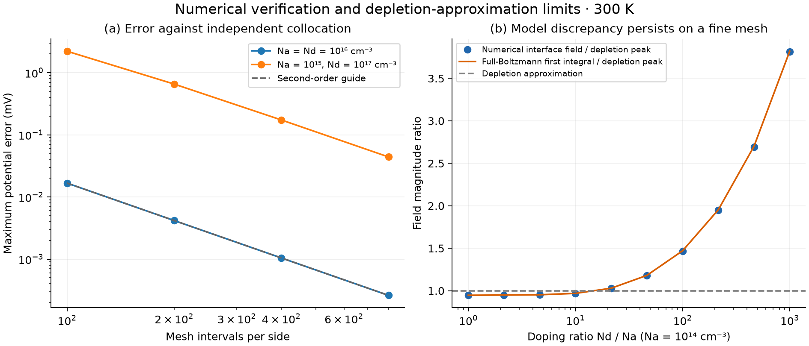

# Scientific verification and validation limits

This project verifies numerical implementations against independent solutions and checks parameter recovery on synthetic observations. It does **not** validate a manufactured diode against experimental measurements.

## Evidence and acceptance criteria

| Check | What it establishes | Observed result |
|---|---|---|
| Silicon model reference | Consistent parameter convention with Project 1 | 300 K ni = 6.1557668 × 10⁹ cm⁻³ |
| Bulk contact neutrality, np = ni² | Correct equilibrium boundary/statistics relationships | Automated tests pass |
| Discrete integrated Gauss law | Charge and field flux use a consistent conservative discretization | Relative error below 10⁻⁸ in tested cases |
| Independent two-domain collocation | Checks the finite-volume solver without reusing its discretization/Newton solve | Nine cases pass; worst potential difference 0.112 mV |
| Full-Boltzmann analytical first integral | Independent interface potential and field check, including mobile charge | Worst interface field error 0.155% across nine cases |
| Mesh refinement | Distinguishes truncation error from a converged residual | Final potential-error reduction factors 4.000 and 3.936 |
| Contact padding | Checks finite boundaries lie sufficiently far into neutral bulk | 12 versus 18 Debye lengths agrees within 20 µV in the tested symmetric case |
| Noiseless diode inversion/recovery | Checks implicit-current solver and fitting | Passes at 250, 300 and 400 K |
| Synthetic noisy recovery | Checks estimation with a known observation model | All three parameters within three local standard errors of truth |
| Covariance, rank and bounds | Prevents unidentified parameters appearing precise | Absolute-noise scaling, rank deficiency and active-bound tests pass |

The nine independent electrostatics comparisons use 250, 300 and 400 K, each with (Na, Nd) = (10¹⁶, 10¹⁶), (10¹⁴, 10¹⁷) and (10¹⁷, 10¹⁴) cm⁻³, at 3,201 nodes. Acceptance gates are 0.25 mV maximum potential discrepancy, 0.5% interface-field discrepancy and a scaled nonlinear residual no larger than 10⁻⁹. These are numerical gates for the specified model, not error bars for real silicon.

See the [machine-readable report](validation_report.json) for all cases, software versions and exact metrics. `examples/reproduce.py` regenerates it and raises an error if its acceptance gates fail. Floating-point/platform differences are expected within the stated tolerances.

## Interpreting the depletion comparison

Left: potential error decreases approximately fourfold when each side's mesh is doubled. The symmetric case uses Na = Nd = 10¹⁶ cm⁻³; the asymmetric case uses Na = 10¹⁵ and Nd = 10¹⁷ cm⁻³. The collocation reference solves the same physical equations independently.

Right: the numerical interface field (3,201 nodes) and analytical full-Boltzmann first integral agree across an asymmetric doping sweep at 300 K with Na fixed at 10¹⁴ cm⁻³. Their difference from the depletion peak is a **model approximation difference**, not evidence that the fine-mesh solution failed. Mobile charge near the interface is omitted by the depletion approximation. The plotted quantity is the interface field, not an arbitrarily thresholded depletion width.

The default 801-node grid is a starting point. Strong asymmetry requires additional resolution; residual convergence alone cannot establish mesh accuracy. Mesh size and contact padding are exposed rather than presenting a universal accuracy guarantee.

## Diode extraction case study

| Parameter | Truth | Fit | Local standard error (1σ) |
|---|---:|---:|---:|
| Is (A) | 1.0000 × 10⁻¹¹ | 9.9474 × 10⁻¹² | 1.1380 × 10⁻¹³ |
| Ideality factor | 1.6000 | 1.599789 | 0.001432 |
| Rs (Ω) | 5.0000 | 4.938152 | 0.051711 |

Reduced chi-square is 1.044628 for 97 residual degrees of freedom. Observations have independent 1.5 mV voltage noise and negligible current error. Local errors use the supplied absolute noise, not a rescaled residual variance. A noiseless synthetic fit still reports nonzero uncertainty when nonzero measurement uncertainty is supplied.

Using only observations at or below 1 µA yields Rs ≈ 97.5 Ω with a local standard error ≈ 1,737 Ω. This does **not** support precise resistance determination. The software flags weak identifiability, and a symmetric Gaussian interval crossing the physical zero-resistance bound is not a global confidence interval. Measuring the resistive high-current region is essential, while avoiding self-heating and high injection that invalidate the compact model.

Uncertainty excludes temperature error, correlated noise, current error and model mismatch. This seeded recovery case is not a statistical coverage study or a claim of experimental validity.

## Figure inspection

All three scientific figures were visually inspected in their raster renders; PNG and SVG come from the same Matplotlib figures. Checks covered labels/units, logarithmic scales, field sign, p/n direction, constant Fermi level, residual definitions, color scale, legend placement and explicit provenance. Vector versions are available beside the PNG files.
